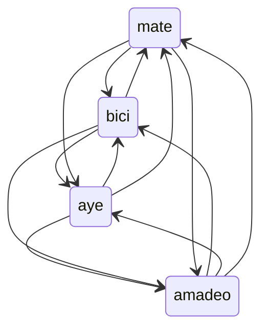

# ¡Hola!

## Mi nombre es Martín :bowtie:

Y soy docente de la Universidad Nacional de Rio Negro, sede Andina

#### Dictando:

 * Introducción a Ingenieria en Computación 
 * [Programación I](https://github.com/INGCOM-UNRN-P1)
 * [Programación II](https://github.com/INGCOM-UNRN-PII)

[Estos son mis alumnos](alumnos.md)

Utilizando

Aunque mi trabajo principal está la Comisión Nacional de Energía Atómica.

Propulsado por :mate: y avido cicloturista :bike:

#### Contribuciones

He aportado a la traducción al español en [futurecoder.io](https://futurecoder.io/) y 
[friendly-traceback](https://github.com/friendly-traceback/friendly-traceback).

Dos excelentes proyectos dedicados a la enseñanza de Python.
